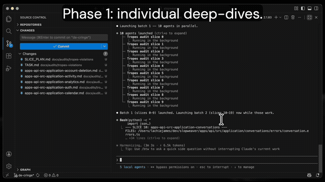

# fan-out-audit

A Claude Code slash command that spins up parallel agents to audit your codebase with thoroughness a single agent can't achieve.



## Install

```bash
cp fan-out-audit.md your-repo/.claude/commands/
```

This is a [Claude Code](https://docs.anthropic.com/en/docs/claude-code) slash command. After copying, invoke it with `/fan-out-audit [your task]`.

## The problem

When you ask an AI coding agent to audit a large codebase, it skims. It can't fit everything in context, so it reads some files, gives surface-level answers, and misses things you'd catch yourself. You've probably felt this: you ask for refactoring opportunities and get a few decent suggestions, but you know there's more it didn't find.

Fan-out auditing fixes this by splitting the work into tiny batches. Instead of one agent skimming 500 files, you get 200 agents each reading 5-8 files. AI gets worse at larger batches. An agent reading 5 files will catch things an agent reading 500 won't.

## How it works

Three phases:

**Phase 1: Pre-filter and fan out.** One grep finds relevant files. Files are grouped into slices of 5-8 (keeping same-directory files together). One agent per slice reads every file and writes structured findings to its own `.md` file. You watch the files appear in your editor in real time.

**Phase 2: Cross-cutting pattern detection.** After all Phase 1 agents complete, a second wave of agents each reads ~12 Phase 1 output files and identifies patterns that span multiple slices. This is where findings like "this same function is reimplemented in 8 modules" emerge, which no individual Phase 1 agent could see.

**Phase 3: Synthesis.** A final pass reads the Phase 2 files and produces a ranked summary: top 10 highest-impact opportunities, deduplicated cross-cutting patterns, and a list of clean zones.

## Usage

```bash
# Check copy against a style guide or tropes list
/fan-out-audit check all user-facing text against ~/Downloads/tropes.md

# Find refactoring opportunities
/fan-out-audit find duplicated logic, consolidation candidates, dead code, library alternatives

# Audit error handling
/fan-out-audit find services that throw exceptions instead of returning Result types

# Check type safety
/fan-out-audit find uses of 'any', missing return types, loose equality, unsafe type assertions

# Architecture review
/fan-out-audit find layer violations, circular dependencies, modules importing from wrong layers

# Target specific directories
/fan-out-audit TARGET=src/app,src/api find components over 200 lines
```

The command asks you to name the output directory (e.g., `tropes-violations`) and shows the full slice plan before launching. You confirm, and agents start running.

## Example output

The `examples/tropes-violations/` directory contains the full output from a real audit: 201 slices, 809 files inspected, 220 output files. Browse it to see exactly what the tool produces.

Key files:
- [`SYNTHESIS.md`](examples/tropes-violations/SYNTHESIS.md) - Final ranked summary
- [`phase1/apps-app-src-components-billing-3.md`](examples/tropes-violations/phase1/apps-app-src-components-billing-3.md) - Example slice with detailed findings (stock SaaS billing copy)
- [`phase1/apps-marketing-src-app.md`](examples/tropes-violations/phase1/apps-marketing-src-app.md) - Example clean slice (no findings, agent explains what it checked)
- [`phase2/group-6.md`](examples/tropes-violations/phase2/group-6.md) - Example cross-cutting patterns ("learning your patterns" used 9 times across 7 slices)

## Configuration

These defaults work well for most codebases. Adjust in the prompt if needed:

| Setting | Default | Why |
|---|---|---|
| Files per slice | 5-8 | Small enough for thoroughness, large enough for context |
| Agents per batch | 10 | Conservative, avoids API rate limits |
| Phase 1 model | Sonnet | File reading is straightforward, cost-efficient |
| Phase 2 model | Opus | Cross-cutting pattern detection needs deeper reasoning |
| Output directory | `audits/{name}/` | In the repo so you can watch files appear |

## Lessons learned (from building this)

**Use `general-purpose` agents, not `Explore`.** Explore agents in Claude Code don't have Write access. They silently fail to create output files. The first version of this tool produced zero output files because of this. `general-purpose` agents have Write access and work correctly.

**Small batches matter more than you'd think.** An agent given 50 files will pattern-match on file names, skip files that "look fine," and produce vague observations. An agent given 5 files reads every line and produces findings with line numbers. The quality difference is dramatic.

**Write to files, not memory.** The first version had agents return findings in their response, and the orchestrator summarized them. An agent finds 8 specific issues with line numbers. The orchestrator compresses them to "several type safety issues found." Detail gone. When every agent writes to its own file, nothing is lost.

**The orchestrator will try to optimize.** Without strong guardrails, the orchestrating Claude instance will second-guess the slice count, re-filter files multiple times, skip Phase 2 "to save time," and synthesize from memory instead of files. The prompt has extensive anti-shortcut language for this reason. If you modify the prompt, keep that language.

**Phase 2 catches what Phase 1 can't.** If 9 different slices all report "custom date formatting," no Phase 1 agent knows that. Phase 2 agents read 12 reports each and surface these cross-cutting patterns. This is where the highest-value consolidation opportunities emerge.

## How it scales

The same prompt works on any size codebase. A repo with 10,000 files produces more slices and takes longer, but the mechanics are identical. The pre-filter step keeps agent count proportional to relevant files, not total files.

| Repo size | Estimated slices | Estimated time |
|---|---|---|
| 100 files | ~15-20 | ~5 min |
| 500 files | ~70-100 | ~15 min |
| 1,000 files | ~150-200 | ~30 min |
| 5,000 files | ~700-1,000 | ~2-3 hours |

## Requirements

- [Claude Code](https://docs.anthropic.com/en/docs/claude-code) (CLI or IDE extension)
- Claude Max, Teams, or API access (the agents consume tokens)

## License

MIT
